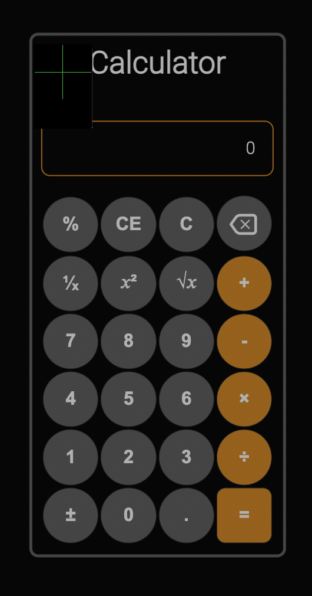

# JavaScript Calculator

This project is a simple yet functional JavaScript calculator. It's designed to perform basic arithmetic operations and showcases the use of JavaScript, HTML, and CSS in creating interactive web applications.
## Application Screenshot

## Contents

- [Introduction](#introduction)
- [Features](#features)
- [Usage](#usage)
- [Code Structure](#code-structure)
- [Contributing](#contributing)

## Introduction

The JavaScript Calculator is a web-based application that allows users to perform basic calculations like addition, subtraction, multiplication, and division. It features a user-friendly interface and responsive design.

## Features

- Basic arithmetic operations: Addition, Subtraction, Multiplication, Division
- Percentage calculation
- Square root, power, and inverse functions
- Keyboard support for operation

## Usage

To use the calculator, simply open the `index.html` file in a web browser. The calculator is ready to use with clickable buttons for each operation.

## Code Structure

- [JavaScript (`code.js`)](https://github.com/Guadeloupe33/JavaSccriptCalculator/blob/main/code.js): Contains the logic for calculator operations and UI interactions.
- [HTML (`index.html`)](https://github.com/Guadeloupe33/JavaSccriptCalculator/blob/main/index.html): Structures the calculator's layout and buttons.
- [CSS (`assets/calc_style.css`)](https://github.com/Guadeloupe33/JavaSccriptCalculator/blob/main/assets/calc_style.css): Styles the calculator's appearance.

## Contributing

Contributions to the project are welcome. Please feel free to fork the repository, make changes, and submit a pull request.

